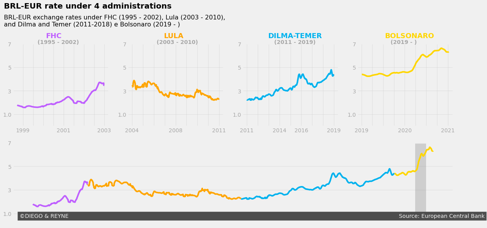
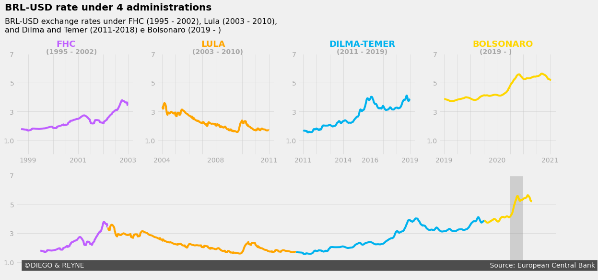

# real_rates
This repo contains the data for the Brazilian real exchange rate during 4 presidencies 

## With USD:

You'll find in this repo all the necessary files to generate the images seen above. The dataset was analysed and is possible to create the images with rates form BRL-USD and BRL-EUR from the last 4 brazilians administrations.

The dataset used was the dataquest.io mission 529 daily euro rates.

----
made by: 

Diego Rodrigues

Reyne Jasson
